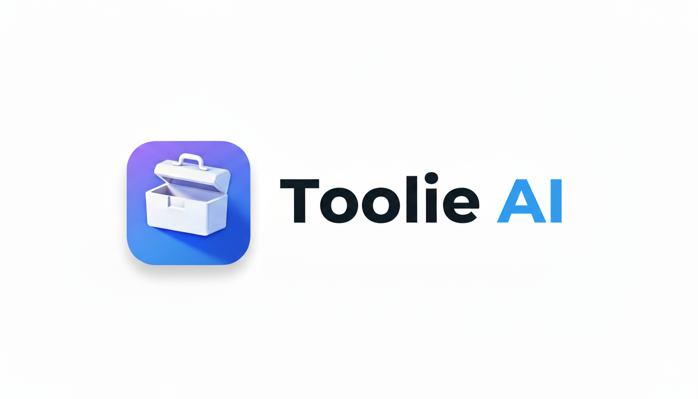

# 🤖 Toolie AI

<div align="center">

[](https://opensource.org/licenses/MIT)
[](http://makeapullrequest.com)
[](https://github.com/SahilSuman1011/Toolie-AI/graphs/contributors)



**Your Enterprise-Grade AI-Powered Productivity Suite**

[Website](https://toolie-ai.com) • [Documentation](https://docs.toolie-ai.com)

---

</div>

## 🌟 Overview

Toolie AI is an enterprise-grade SaaS platform that harnesses cutting-edge AI technologies to revolutionize productivity and creative workflows. Built with scalability and performance in mind, it offers a comprehensive suite of AI-powered tools for content creation, image manipulation, and document analysis.

### Key Benefits

- 🚀 **Enterprise Performance**: Built for scale with modern tech stack
- 🔒 **Enterprise-Grade Security**: SOC2 compliant with robust authentication
- 🎯 **AI-Powered Automation**: Streamline repetitive tasks
- 💼 **Business Ready**: Team management and collaboration features
- 📊 **Advanced Analytics**: Usage tracking and performance metrics

## ✨ Features

### Core Features
- 🎨 **Modern UI/UX**
  - Stunning dark mode design with emerald/cyan/amber color scheme
  - Glassmorphic cards with backdrop blur effects
  - Smooth animations and transitions throughout
  - Responsive layout optimized for all devices
  - Floating decorative icons with gradient animations
  - Bento grid layout showcasing AI tools with central logo card
  - Mobile-optimized sidebar with dark slate theme
  - Enhanced hover effects and interactive elements

- 🔒 **Authentication & Authorization**
  - Secure authentication powered by Clerk
  - Protected routes and API endpoints
  - Session management with JWT tokens
  - Premium tier access control
  - Social login integration (Google, GitHub)
  - Automatic usage tracking and limits

- 📊 **Dashboard**
  - Dark-themed interface with emerald accent colors
  - Intuitive sidebar navigation with tool categories
  - Recent creations display with metadata
  - User profile integration with Clerk
  - Real-time creation statistics
  - Active plan indicator (Free/Premium)
  - Smooth loading states and error handling
  - Responsive design for mobile and desktop

### AI Tools

- ✍️ **AI Article Writer** (Fully Functional ✅)
  - Content generation using Cohere AI (command-r-08-2024)
  - Customizable article lengths (500-1600+ words)
  - Topic-based generation
  - Markdown formatting support
  - One-click copy functionality
  - Automatic retry on rate limits (5 attempts with exponential backoff)
  - Free tier: 10 articles/month
  - Premium: Unlimited

- 📝 **Blog Title Generator** (Fully Functional ✅)
  - AI-powered title suggestions via Cohere
  - 10+ category options (General, Technology, Health, Finance, etc.)
  - SEO-optimized suggestions
  - One-click copy feature
  - Category-based customization
  - Free tier: 10 titles/month
  - Premium: Unlimited

- 💼 **LinkedIn Optimizer** (Fully Functional ✅)
  - Profile content enhancement with Cohere AI
  - Headline optimization
  - About section rewriting
  - Experience highlights enhancement
  - Skills section optimization
  - Professional tone adjustment
  - Keyword optimization for LinkedIn algorithm
  - Markdown formatted output
  - Easy copy/paste functionality
  - Premium feature only

- 🎨 **AI Image Generation** (Fully Functional ✅)
  - Text-to-image generation with Clipdrop API
  - High-resolution output (1024x1024)
  - Public/private sharing options
  - Cloudinary integration for storage
  - Easy download functionality
  - Premium feature only

- 🖼️ **Background Removal** (Fully Functional ✅)
  - One-click background removal via Cloudinary
  - Transparent PNG output
  - High-quality processing
  - Instant download option
  - Premium feature only

- ✂️ **Object Removal** (Fully Functional ✅)
  - Smart object selection and removal
  - Content-aware fill using Cloudinary AI
  - Original quality preservation
  - Quick download feature
  - Premium feature only

### Community Features
- 🌟 **Creation Sharing**
  - Public gallery with dark theme design
  - User-generated AI image showcase
  - One-click download functionality
  - Responsive grid layout with smooth hover effects
  - Image prompts displayed on hover
  - Real-time gallery updates

## 🚀 Quick Start

### Prerequisites
- Node.js 16+ and npm
- Clerk account for authentication
- Cohere API key (for AI text generation)
- Clipdrop API key (for image generation)
- Cloudinary account (for image storage)
- PostgreSQL database (Neon recommended)

### Installation

```bash
# Clone the repository
git clone https://github.com/SahilSuman1011/Toolie-AI.git

# Frontend setup
cd Toolie-AI/client
npm install
npm run dev

# Backend setup (in a new terminal)
cd ../server
npm install
npm run dev
```

### Environment Variables

#### Frontend (.env)
```env
VITE_CLERK_PUBLISHABLE_KEY=your_clerk_publishable_key
VITE_API_BASE_URL=http://localhost:3000  # For local development
# VITE_API_BASE_URL=https://your-backend.vercel.app  # For production
```

#### Backend (.env)
```env
PORT=3000
COHERE_API_KEY=your_cohere_api_key
CLERK_PUBLISHABLE_KEY=your_clerk_publishable_key
CLERK_SECRET_KEY=your_clerk_secret
CLIPDROP_API_KEY=your_clipdrop_key
CLOUDINARY_CLOUD_NAME=your_cloud_name
CLOUDINARY_API_KEY=your_api_key
CLOUDINARY_API_SECRET=your_api_secret
DATABASE_URL=your_postgresql_connection_string
```

## 🛠 Tech Stack

### Frontend
- **Framework**: React 18 with Vite
- **Styling**: TailwindCSS v4 with custom dark theme
- **Animations**: Framer Motion for smooth transitions
- **Icons**: Lucide React icon library
- **Authentication**: Clerk React SDK
- **HTTP Client**: Axios with interceptors
- **Notifications**: React Hot Toast
- **Markdown**: React Markdown for content rendering
- **Routing**: React Router DOM v6

### Backend
- **Runtime**: Node.js 18+
- **Framework**: Express.js 5
- **Database**: PostgreSQL (Neon Serverless)
- **Authentication**: Clerk Express SDK
- **AI Services**:
  - Cohere API (Text Generation - command-r-08-2024 model)
  - Clipdrop API (Image Generation & Background Removal)
  - Cloudinary AI (Background & Object Removal)
- **Image Storage**: Cloudinary
- **File Upload**: Multer
- **Middleware**: CORS, Express JSON, Custom Auth
- **Error Handling**: Retry logic with exponential backoff (5 attempts, 3s-48s delays)
- **Security**: Rate limiting, CORS policies, secure headers

## 📐 Project Structure

```
Toolie-AI/
├── client/                      # Frontend React application
│   ├── public/                 # Static assets
│   │   ├── ai-icons/          # Tool icons (12 icons)
│   │   └── gradientBackground.png
│   └── src/
│       ├── assets/            # Asset exports (images, tool data)
│       ├── components/        # React components
│       │   ├── ui/           # Reusable UI components
│       │   ├── AiTools.jsx   # Bento grid with tools
│       │   ├── CreationItem.jsx  # Creation card component
│       │   ├── FAQ.jsx       # FAQ accordion (dark theme)
│       │   ├── Footer.jsx    # Site footer (dark theme)
│       │   ├── Hero.jsx      # Landing hero with floating icons
│       │   ├── Navbar.jsx    # Navigation bar (dark theme)
│       │   ├── Plan.jsx      # Pricing cards (emerald theme)
│       │   ├── Sidebar.jsx   # Dashboard sidebar (dark slate)
│       │   └── Testimonial.jsx  # User testimonials
│       └── pages/            # Page components
│           ├── BlogTitles.jsx       # Blog title generator (cyan theme)
│           ├── Community.jsx        # Public gallery (dark theme)
│           ├── Dashboard.jsx        # User dashboard (dark theme)
│           ├── GenerateImages.jsx   # Image generation (amber theme)
│           ├── Home.jsx            # Landing page
│           ├── Layout.jsx          # Dashboard layout wrapper
│           ├── LinkedInOptimizer.jsx  # LinkedIn tool (amber theme)
│           ├── RemoveBackground.jsx # BG removal (pink theme)
│           ├── RemoveObject.jsx    # Object removal (purple theme)
│           └── WriteArticle.jsx    # Article writer (emerald theme)

### AI Routes (`/api/ai`)
- `POST /generate-article` - Generate AI article (auth required)
- `POST /generate-blog-title` - Generate blog titles (auth required)
- `POST /generate-image` - Generate AI image (auth + premium required)
- `POST /remove-image-background` - Remove image background (auth + premium + file upload)
- `POST /remove-image-object` - Remove object from image (auth + premium + file upload)
- `POST /linkedin-optimize` - Optimize LinkedIn profile (auth + premium required)

### User Routes (`/api/user`)
- `GET /get-user-creations` - Fetch user's all creations (auth required)
- `GET /get-published-creations` - Fetch public gallery (auth required)
- `POST /toggle-like-creation` - Like/unlike creation (auth required)

### Health Check
- `GET /` - Server status
- `GET /health` - Detailed health check

## 🔒 Premium Features

The following features require a Premium subscription (managed via Clerk):
- ✨ AI Image Generation
- 🖼️ Background Removal
- ✂️ Object Removal
-  🔧 Implementation Status

### Completed Features ✅ Profile Optimizer

Free tier limitations:
- Article Writer: 10 articles/month
- Blog Title Generator: 10 titles/month # Landing page
│           ├── Layout.jsx          # Dashboard layout
│           ├── LinkedInOptimizer.jsx  # LinkedIn tool
│           ├── RemoveBackground.jsx # BG removal
│           ├── RemoveObject.jsx    # Object removal
│           └── WriteArticle.jsx    # Article writer
│
├── server/                      # Backend Node.js application
│   ├── configs/               # Configuration setup
│   │   ├── cloudinary.js     # Cloudinary SDK config
│   │   ├── db.js             # Neon PostgreSQL config
│   │   └── multer.js         # File upload config
│   ├── controllers/          # Route controllers
│   │   ├── aiController.js   # AI features (6 endpoints)
│   │   └── userController.js # User data (3 endpoints)
│   ├── middlewares/         # Custom middlewares
│   │   └── auth.js          # Clerk authentication
│   ├── routes/              # API routes
│   │   ├── aiRoutes.js      # AI tool routes
│   │   └── userRoutes.js    # User data routes
│   └── uploads/             # Temporary file storage
```

## 🔧 Current Implementation Status

### Completed ✅
- ✅ Complete UI revamp with dark mode design
- ✅ Emerald/cyan/amber color scheme implementation
- ✅ Bento grid layout with central logo card
- ✅ Authentication system with Clerk
- ✅ Responsive design and mobile optimization
- ✅ Protected routes and API security
- ✅ All 6 AI tools fully functional
- ✅ Backend API with Cohere AI integration
- ✅ PostgreSQL database with Neon
- ✅ User creation tracking system
- ✅ Premium tier access control
- ✅ Rate limiting with retry logic
- ✅ CORS configuration for production
- ✅ Error handling and user feedback
- ✅ Community gallery features
- ✅ Dark-themed dashboard and sidebar

## 🗺️ Roadmap

### Phase 1 (Completed ✅)
- ✅ Core AI tool implementations (6 tools)
- ✅ Backend API structure with Express.js
- ✅ Premium tier system via Clerk
- ✅ Error handling and loading states
- ✅ Retry logic for API calls
- ✅ Complete UI revamp with dark theme
- ✅ Responsive design for all devices

### Phase 2 (In Progress 🔄)
- 🔄 AI response time optimization
- 🔄 Enhanced dashboard analytics
- 🔄 Content history and management
- 🔄 Batch processing capabilities
- 🔄 Advanced community features
- 🔄 Usage insights and reporting

### Phase 3 (Planned ⏳)
- ⏳ Team collaboration features
- ⏳ Advanced sharing capabilities
- ⏳ Real-time collaboration tools
- ⏳ API access for developers
- ⏳ Mobile application
- ⏳ Additional AI tools and integrations

## 🤝 Contributing

This project is licensed under the MIT License - see the [LICENSE](LICENSE) file for details.

---

<div align="center">
  Made with ❤️ by <a href="https://github.com/SahilSuman1011">Sahil Suman</a>
</div>
